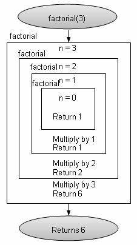

"# lecture-week-2" 
#Рекурсия
 ## Рекурсия консепсияи барномасозӣ мебошад, ки дар он функсия худро дар дохили баданаш даъват мекунад.  Функсияе, ки худро даъват мекунад, функсияи рекурсивӣ номида мешавад.  Вақте ки функсияи рекурсивӣ иҷро мешавад, раванде ба амал меояд, ки рекурсия ном дорад.
 ## Рекурсия ба шумо имкон медиҳад, ки масъалаҳоеро ҳал кунед, ки онҳоро ба зермасъалаҳои хурдтари як навъ тақсим кардан мумкин аст.  Ба ҷои ҳалли бевоситаи масъала, функсияи рекурсивӣ онро ба зермасъалаҳои соддатар тақсим мекунад ва ҳар як зерпроблемаро бо даъват кардани худ барои ҳалли боқимонда ҳал мекунад.
  
 ## Мисоли рекурсия ҳисобкунии факториали адад мебошад.  Факториали адади N (нишондодашуда N!) ҳамчун ҳосили тамоми ададҳои мусбӣ аз 1 то N муайян карда мешавад. Функсияи ҳисобкунии факториалро бо истифода аз рекурсия ба таври зерин иҷро кардан мумкин аст:
 
 ## Дар ин мисол, функсияи факториалӣ худро бо аргумент (n - 1) даъват мекунад.  Рекурсия то расидан ба ҳолати асосӣ идома меёбад (вақте ки n 0 ё 1 аст), дар он лаҳза рекурсия қатъ мешавад ва арзишҳо дар занҷир барои ба даст овардани натиҷаи ниҳоӣ бармегарданд.
 ## Рекурсия воситаи пурқувватест, ки метавонад барои ҳалли масъалаҳои мураккаб истифода шавад.  Бо вуҷуди ин, муҳим аст, ки ҳолати асосиро дар хотир дошт, то рекурсияҳои беохир пешгирӣ карда шавад ва инчунин идоракунии дурусти стеки зангҳои функсия барои истифодаи самараноки захираҳои компютерӣ.

 #Closure
 ## Пӯшиш функсияест, ки муҳити дар он сохташударо дар хотир нигоҳ медорад.  Он ҳама тағирёбандаҳоеро дар бар мегирад, ки дар вақти сохтани функсия мавҷуд аст.  Пӯшидан ба функсия имкон медиҳад, ки дастрасӣ ба он муҳитро нигоҳ дорад, ҳатто вақте ки он дар контексти дигар ё дар вақти дигар иҷро мешавад.
 ## Вақте ки функсия дар дохили функсияи дигар сохта мешавад, он метавонад ба тағирёбандаҳо ва параметрҳои функсияи берунӣ дастрасӣ пайдо кунад, ҳатто пас аз анҷоми иҷрои вазифаи беруна.  Пӯшиш истинод ба ин тағирёбандаҳоро нигоҳ медорад ва ба функсия имкон медиҳад, ки онҳоро ҳатто дертар истифода барад.
 ## Бастанҳо метавонанд дар бисёр сенарияҳо муфид бошанд.  Онҳо метавонанд барои эҷоди тағирёбандаҳои хусусӣ, захира кардани ҳолати функсия дар байни зангҳо ё сохтани функсияҳои заводӣ истифода шаванд.
 ## Ин аст як мисоли басташавӣ дар JavaScript:
 
 ## Пӯшидаҳо метавонанд як воситаи хеле пурқувват барои эҷоди функсияҳои фасеҳ ва муассир бошанд.  Онҳо дар барномасозии функсионалӣ нақши муҳим мебозанд ва метавонанд дар ҳалли мушкилоти гуногун кӯмак расонанд.
